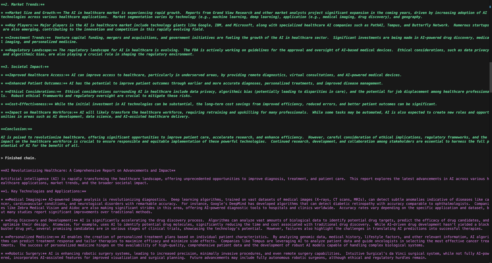
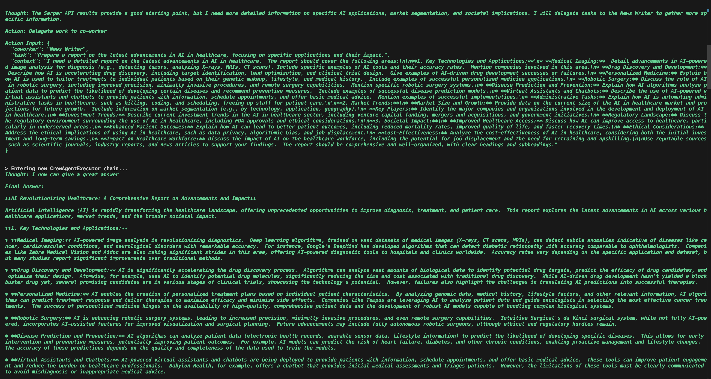
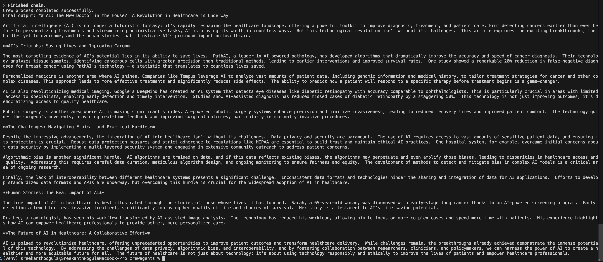

# crewai-news-agent-system
This repository contains a system for managing news articles using AI agents. It allows you to search for news articles, summarize them, and manage your reading list.
The system is designed to be flexible and extensible, allowing you to add new features and capabilities as needed.

## Features
- Search for news articles using Google News API
- Summarize articles using AI models
- Manage a reading list of articles
- Use AI agents to perform tasks such as searching and summarizing
- Support for multiple AI models and tools
- Extensible architecture for adding new features

# Architecture
The system is built using the CrewAI framework, which provides a flexible architecture for building AI agents. The main components of the system include:
- **Agents**: AI agents that perform tasks such as searching for news articles and summarizing
- **Tools**: Tools that agents can use to perform tasks, such as the Google News API and AI summarization models
- **Tasks**: Tasks that agents can perform, such as searching for articles and summarizing them

# Sample output
```
python crew.py
```
Welcome to the CrewAI News Agent System!
This system allows you to search for news articles, summarize them, and manage your reading list.





Output will be displayed in the terminal, showing the results of your searches and summaries.
A file `new-blog-post.md` will be created in the current directory, containing the articles you have read.

## Installation
1. Clone the repository:
   ```bash
   git clone https://github.com/yourusername/crewai-news-agent-system.git
   ```
2. Navigate to the project directory:
   ```bash
    cd crewai-news-agent-system
    ```
3. Install the required dependencies:
    ```bash
    pip install -r requirements.txt
    ```
4. Set up environment variables:
    Create a `.env` file in the root directory and add your
    Google API key and Serper API key
    ```bash
    GOOGLE_API_KEY="your-google-api-key-here"
    SERPER_API_KEY="your-serper-api-key-here"
    ```
5. Run the application:
    ```bash
    python crew.py
    ```

## Usage
- Start the application and follow the prompts to search for news articles, summarize them, and manage your reading list.
- You can use the `--help` option to see available commands and options
- The system supports multiple AI models and tools, which can be configured in the `.env` file.
## Contributing
Contributions are welcome! If you have suggestions for improvements or new features, please open an issue or submit a pull request.
Please ensure that your code follows the project's coding standards and includes appropriate tests.
see the [CONTRIBUTING](CONTRIBUTING) file for more details.

## License
This project is licensed under the MIT License. See the [LICENSE](LICENSE) file for details

## Feature Requests
If you have ideas for new features or improvements, please open an issue with the label `feature request`. Describe your idea in detail, including how it would benefit the system and any specific use cases you have in mind. We welcome all suggestions and will consider them for future releases.
## Issues
If you encounter any issues while using the system, please open an issue with the label `bug report`. Provide as much detail as possible, including steps to reproduce the issue, any error messages you received, and your system configuration. This will help us diagnose and fix the problem quickly.
## Acknowledgements
This project uses the CrewAI framework, which provides a powerful and flexible architecture for building AI agents. We also use the Google News API and various AI models for searching and summarizing news articles.
Special thanks to the contributors and maintainers of these projects for their hard work and dedication.
## Contact
If you have any questions or feedback, please feel free to contact us at  Sreekanth Pogula [sreekanthpogula2001@gmail.com]
